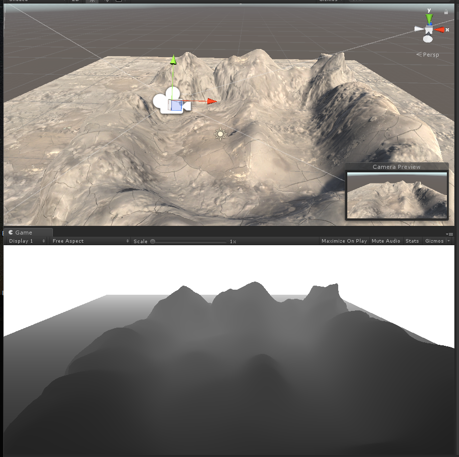
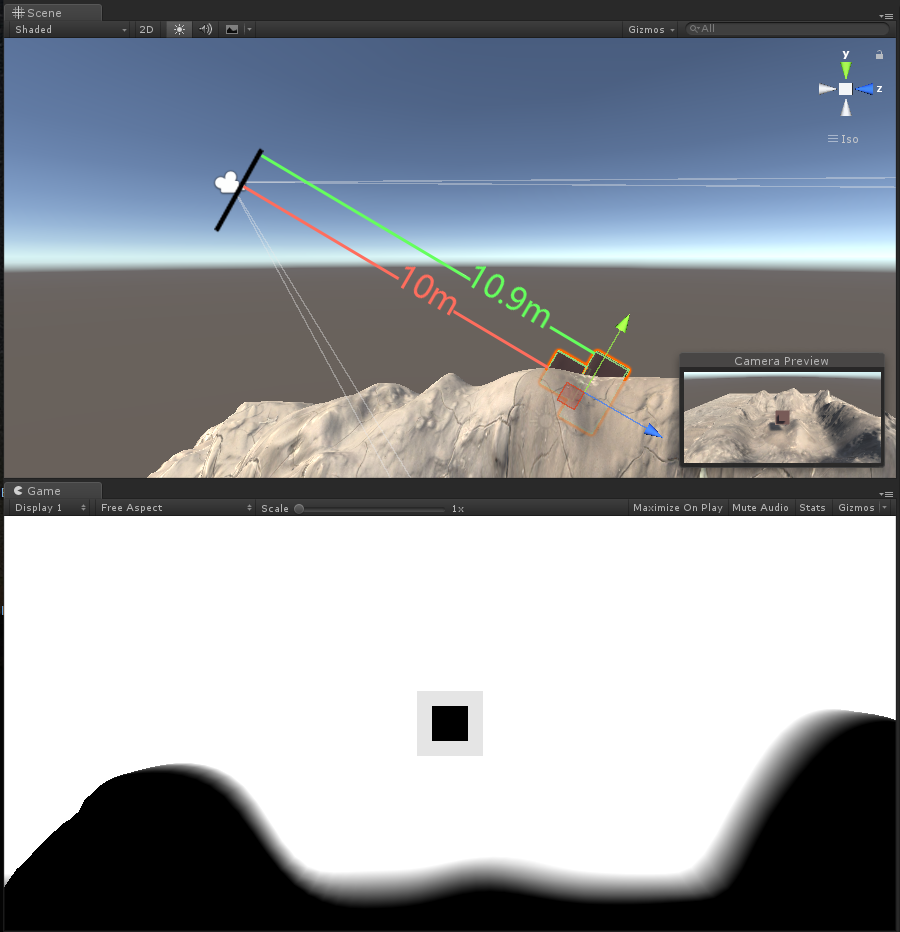
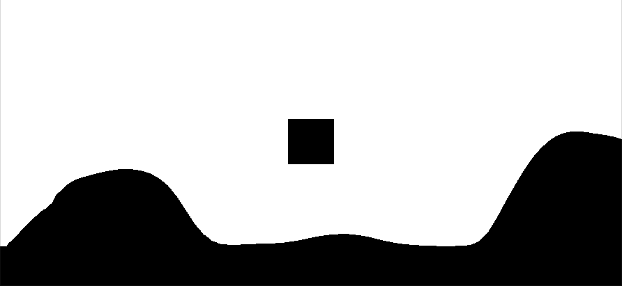
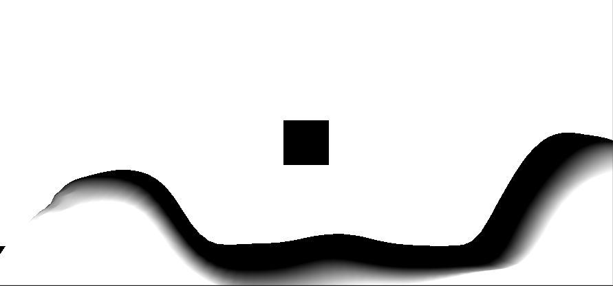
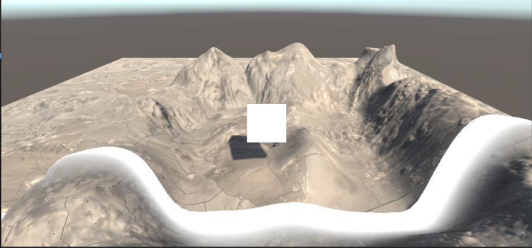
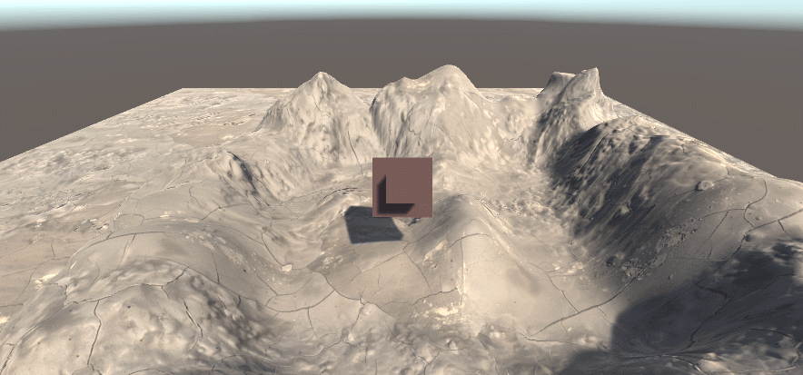
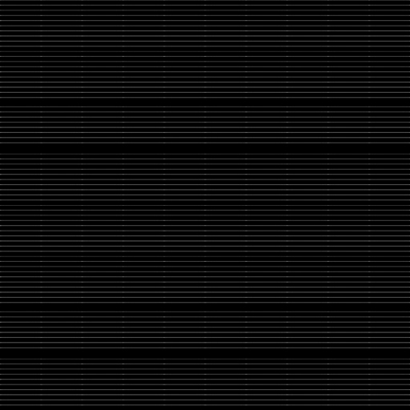
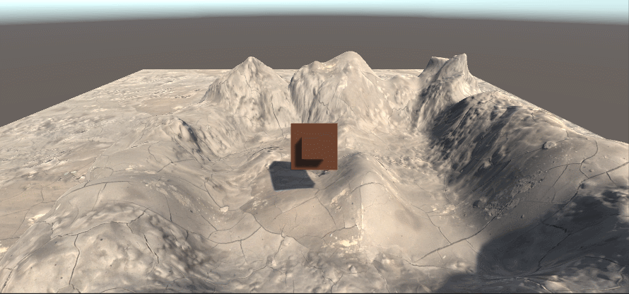

# 屏幕后期处理效果

在渲染完整个场景之后，得到的屏幕图像进行了一系列操作，最终实现各种屏幕特效，如Bloom，SSAO等等。

要实现屏幕后期处理的基础是，必须得到渲染后的屏幕图像，即抓取屏幕，而Unity为我们提供了这样一个方便的接口---OnRenderImage函数。

## 写在前面

简单介绍几个常用名词。

### 0.1 UV

U和V分别是图片在显示器水平、垂直方向上的坐标，取值范围是0~1。通常是从左往右，从下往上从0开始依次递增。

## 1.基础类

在进行屏幕后期处理之前，我们需要检查一系列条件是否满足，例如当前平台是否支持渲染纹理跟屏幕特效。是否支持当前使用的shader等。为此，我们创建了一个用于屏幕后期处理效果的基类。在实现各种屏幕特效时，我们只需继承基础类。在实现派生类中不同操作即可。

```csharp
using UnityEngine;
using System.Collections;

[ExecuteInEditMode]
[RequireComponent (typeof(Camera))]
public class PostEffectsBase : MonoBehaviour {

    // 开始检查
    protected void CheckResources() {
        bool isSupported = CheckSupport();

        if (isSupported == false) {
            NotSupported();
        }
    }

    // 在检查是否支持屏幕后期shader的时候调用
    protected bool CheckSupport() {
        if (SystemInfo.supportsImageEffects == false || SystemInfo.supportsRenderTextures == false) {
            Debug.LogWarning("This platform does not support image effects or render textures.");
            return false;
        }

        return true;
    }

    // 在不支持屏幕后期shader的时候调用。
    protected void NotSupported() {
        enabled = false;
    }

    protected void Start() {
        CheckResources();
    }

    // 在需要通过该屏幕后期shader创建相应材质的时候调用。
    protected Material CheckShaderAndCreateMaterial(Shader shader, Material material) {
        if (shader == null) {
            return null;
        }

        if (shader.isSupported && material && material.shader == shader)
            return material;

        if (!shader.isSupported) {
            return null;
        }
        else {
            material = new Material(shader);
            material.hideFlags = HideFlags.DontSave;
            if (material)
                return material;
            else 
                return null;
        }
    }
}
```

### 基础类使用案例(继承PostEffectBase)

```csharp
using System.Collections;
using System.Collections.Generic;
using UnityEngine;

public class ImageEffectGeneral : PostEffectsBase{
    public Shader scannerShader;
    private Material scannerMaterial;
    public Material material
    {
        get
        {
            // 检查是否生成对应材质
            scannerMaterial = CheckShaderAndCreateMaterial(scannerShader, scannerMaterial);
            return scannerMaterial;
        }
    }
    //定义相关数据调整
    public string dataTags = "";
    public float dataScale = 1.0f;
    public new void Start()
    {
        //如果需要提前规定Camera获取深度纹理或者法线纹理，需要提前声明
        //GetComponent<Camera>().depthTextureMode = DepthTextureMode.DepthNormals;
    }

    void OnRenderImage(RenderTexture src, RenderTexture dest)
    {
        //GetComponent<Camera>().depthTextureMode = DepthTextureMode.DepthNormals;
        if (material != null)
        {
            //需要传入的数据，需要在Shader中定义好对应变量名称，作为传入依据。
            material.SetFloat(dataTags, dataScale);
            Graphics.Blit(src, dest, material);
        }
        else
        {
            Graphics.Blit(src, dest);
        }
    }
}
```

## 2.使用渲染纹理

在Unity中，获取深度纹理是非常简单的，直接在脚本中设置摄像机的depthTextureMode，就可以获取对应的纹理数据。

深度纹理获取

```csharp
GetComponent<Camera>().depthTextureMode = DepthTextureMode.Depth;
```

法线纹理+深度纹理获取：

```csharp
GetComponent<Camera>().depthTextureMode = DepthTextureMode.DepthNormals;
```

#### 深度纹理采样

当在Shader中访问到深度纹理 _CameraDepthTexture 后，我们就可以使用当前像素的纹理坐标对它进行采样。绝大多数情况下，我们直接使用tex2D函数采样即可，但在某些平台（例如PS3或者PSP）上，我们需要一些特殊处理。Unity为我们提供了一个统一的宏，SAMPLE_Depth_Texture，用来处理这些由于平台差异造成的问题。

#### 法线纹理采样

用以下语句进行的法线采样，是范围在-1~1之间的水平&垂直法线值，如果需要展示成法线贴图，需要手动对normal进行归一化处理 normal = 0.5*normal+0.5

```cpp
fixed3 normal = DecodeViewNormalStereo(tex2D(_CameraDepthNormalsTexture,i.uv));
```

# 

# 屏幕后期处理效果实例

## 1.uv应用：扭曲

通过重新计算uv，采用黑白图来对uv进行重新赋值，可以产生扭曲的效果。

```cpp
Shader "Hidden/ImageDistort"
{
    Properties
    {
        _MainTex ("Texture", 2D) = "white" {}
        _DistortTex ("Distort Texture", 2D) = "white" {}
        _DistortScale ("Distort Scale",Range(0,1)) = 1.0 
    }
    SubShader
    {
        // No culling or depth
        Cull Off ZWrite Off ZTest Always

        Pass
        {
            CGPROGRAM
            #pragma vertex vert
            #pragma fragment frag

            #include "UnityCG.cginc"

            sampler2D _MainTex;
            sampler2D _DistortTex;
            float _DistortScale;

            struct appdata
            {
                float4 vertex : POSITION;
                float2 uv : TEXCOORD0;
            };

            struct v2f
            {
                float2 uv : TEXCOORD0;
                float4 vertex : SV_POSITION;
            };

            v2f vert (appdata v)
            {
                v2f o;
                o.vertex = UnityObjectToClipPos(v.vertex);
                o.uv = v.uv;
                return o;
            }

            fixed4 frag (v2f i) : SV_Target
            {
                //i.uv = abs(0.5-i.uv);
                fixed4 noise = tex2D(_DistortTex,i.uv);
                i.uv = i.uv + (0.5-noise.r) * _DistortScale*0.1;
                fixed4 col = tex2D(_MainTex, i.uv);
                // just invert the colors
                //col.rgb = 1 - col.rgb;
                return col;
            }
            ENDCG
        }
    }
}
```

使用时，可以参考上述中的，基础类使用案例，编写对应的cs脚本并挂在摄像机上，通过调整相关参数来观看对应效果

## 2.深度纹理应用：扫描效果探究

深度图的每一个像素值表示场景中某点与摄像机的距离。

是指将从图像采集器到场景中各点的距离（深度）作为像素值的图像，它直接反映了景物可见表面的几何形状。

shader中，深度图的获取可以通过以下代码进行

```cpp
float depth = SAMPLE_DEPTH_TEXTURE(_CameraDepthTexture,i.uv);
float linearDepth = Linear01Depth(depth);
fixed4 col = fixed4(linearDepth,linearDepth,linearDepth,1);
```

当通过纹理采样SAMPLE_DEPTH_TEXTURE之后，得到的深度值往往是非线性的。然而，我们的计算过程中通常是需要线性的深度值，也就是说，我们需要把投影后的深度值变换到线性空间下。

最终结果如下，上图为原始场景，下图为场景中提取的深度图（通过Linear01Depth解码）

0表示该点和摄像机处于同一位置，1表示该点位于视锥体的远裁剪平面上（摄像机Near=0.3 Far=50）



LinearEyeDepth负责把深度纹理的采样结果转换到视角空间下的深度值

LinearEyeDepth解码，此时的摄像机远裁剪平面与近裁剪平面并不会对结果产生影响，通过调节参数_DepthParam，看对应的变化区间（下图为_DepthParam为10的样子，即黑的部分是离镜头10m以内的，白色部分是离镜头11m以外的，模糊的部分为距离10-11m之间的值）

```cpp
float depth = SAMPLE_DEPTH_TEXTURE(_CameraDepthTexture,i.uv);
float linearDepth = LinearEyeDepth(depth);
float diff = linearDepth-_DepthParam;
```



使用floor函数，对上述的值进行取整，并对采样值归一化，可以得到比较尖锐化的边缘，此时深度在11m范围内的部分会全部变成黑色。

```cpp
float depth = SAMPLE_DEPTH_TEXTURE(_CameraDepthTexture,i.uv);
float linearDepth = LinearEyeDepth(depth);
float diff = linearDepth-_DepthParam;
diff = saturate(floor(diff));
```



通过负数取值归一化，可对采样值进行反色，让黑的部分变白，白的部分变黑。

```cpp
float depth = SAMPLE_DEPTH_TEXTURE(_CameraDepthTexture,i.uv);
float linearDepth = LinearEyeDepth(depth);
float diff = linearDepth-_DepthParam;
diff = saturate(-diff);
```


上述操作中，如果不进行归一化（取值范围限制在0-1之间）的话，黑的部分可能会产生负数，白的部分可能会超过1，最终可能计算不出正确结果。

将上述两张图按加算合起来，得到一个按深度扫描的效果雏形

```cpp
float depth = SAMPLE_DEPTH_TEXTURE(_CameraDepthTexture,i.uv);
float linearDepth = LinearEyeDepth(depth);
float diff = linearDepth-_DepthParam;
diff = saturate(floor(diff))+saturate(-diff);
```



得到这部分后，因为归一化前面已经做过了，我们仅需要对上述结果进行反色处理(1-diff)，再混合上原背景（对原图像进行插值处理，此时我们用到前面所提到的插值函数lerp），就可以看到对应的扫描效果了。

```cpp
fixed4 mainTex = tex2D(_MainTex, i.uv);
float depth = SAMPLE_DEPTH_TEXTURE(_CameraDepthTexture,i.uv);
float linearDepth = LinearEyeDepth(depth.r);
fixed4 col = fixed4(linearDepth,linearDepth,linearDepth,1);
float diff = linearDepth-_DepthParam;
fixed4 border = 1-(saturate(floor(diff))+saturate(-diff*0.5));
fixed4 final = lerp(mainTex,border*_DepthColor,border); 
return final;
```



下面提供完整代码

ExampleScannerImage.shader

```cpp
Shader "Hidden/ExampleScannerImage"
{
    Properties
    {
        _MainTex ("Texture", 2D) = "white" {}
        _DepthParam ("DepthParam",Float) = 1.0
        _DepthColor("DepthColor",Color) = (1,1,1,1)
    }
    SubShader
    {
        // No culling or depth
        Cull Off ZWrite Off ZTest Always

        Pass
        {
            CGPROGRAM
            #pragma vertex vert
            #pragma fragment frag
            #include "UnityCG.cginc"

            sampler2D _MainTex;
            sampler2D _CameraDepthTexture;
            float _DepthParam;
            fixed4 _DepthColor;

            struct appdata
            {
                float4 vertex : POSITION;
                float2 uv : TEXCOORD0;
            };

            struct v2f
            {
                float2 uv : TEXCOORD0;
                float4 vertex : SV_POSITION;
            };

            v2f vert (appdata v)
            {
                v2f o;
                o.vertex = UnityObjectToClipPos(v.vertex);
                o.uv = v.uv;
                return o;
            }

            fixed4 frag (v2f i) : SV_Target
            {
                fixed4 mainTex = tex2D(_MainTex, i.uv);
                float depth = SAMPLE_DEPTH_TEXTURE(_CameraDepthTexture,i.uv);
                float linearDepth = LinearEyeDepth(depth.r);
                float diff = linearDepth-_DepthParam;
                fixed4 border = 1-(saturate(floor(diff))+saturate(-diff*0.5));
                fixed4 final = lerp(mainTex,border*_DepthColor,border); 
                return final;
            }
            ENDCG
        }
    }
}
```

PostEffects.cs（参考本篇开头）

ImageScannerEffect.cs

```csharp
using System.Collections;
using System.Collections.Generic;
using UnityEngine;

public class ImageScannerEffect : PostEffectsBase
{
    public Shader scannerShader;
    private Material scannerMaterial;
    public Material material
    {
        get
        {
            // 检查是否生成对应材质
            scannerMaterial = CheckShaderAndCreateMaterial(scannerShader, scannerMaterial);
            return scannerMaterial;
        }
    }
    //定义相关数据调整
    public float dataScale = 1.0f;
    public Color dataColor = Color.white;

    void OnRenderImage(RenderTexture src, RenderTexture dest)
    {
        //GetComponent<Camera>().depthTextureMode = DepthTextureMode.DepthNormals;
        if (material != null)
        {
            material.SetFloat("_DepthParam", dataScale);
            material.SetColor("_DepthColor", dataColor);
            Graphics.Blit(src, dest, material);
        }
        else
        {
            Graphics.Blit(src, dest);
        }
    }
}
```

使用时，将ImageScannerEffect.cs拖拽至主摄像机中，并且把ExampleScannerImage.shader 这个文件拖至Scanner Shader选项卡中去。

录制动画，调节脚本中DataScale选项依次增大，完成相关扫描特效的制作。

可以根据自己喜好，调整相关颜色等操作。

添加图片遮罩，根据法线纹理生成网格纹理等等我们后续会接着讲。



## 3.纹理附加：扫描效果探究（续）

在上图中，我们由于为对插值处理进行相关优化，所以在尾部会出现一些黑色的部分，这些黑色的部分是因为原本的图像是呈现黑色的。

这次我们使用一张附加纹理，使得扫描效果更具科技感一些

这次是我们使用的附加纹理原图



在使用上述图片之前，我们需要了解uv转换函数TRANSFORM_TEX

TRANSFORM_TEX方法比较简单，就是将模型顶点的uv和Tiling、Offset两个变量进行运算，计算出实际显示用的定点uv。

如果对_MaskTex这个纹理进行uv转换，必须声明变量_MaskTex_ST(float4类型)

实际调整的时候，_MaskTex_ST.xy代表Tilling（缩放程度），_MaskTex_ST.zw代表Offset（偏移程度）

我们在声明变量的时候，沿用_MaskTex的同时下方添加一个ST的声明即可

```cpp
sampler2D _MaskTex;
float4 _MaskTex_ST;
float _MaskTexTillY;
```

片元着色器

```cpp
_MaskTex_ST.y = _MaskTexTillY;
i.uv = TRANSFORM_TEX(i.uv, _MaskTex);
fixed4 maskTex = tex2D(_MaskTex,i.uv);
```

在附加纹理时，可以通过两种方式进行，一种是附加法，一种是累乘法

我们这里使用了带颜色的附加法进行（因为包含了黑色，原本是黑色的部分就不会变化）

同样的，我们在原本的基础上使用了_DepthColor.a 作为底图的影响程度，这样可以淡化尾部的黑色部分。

```cpp
fixed4 final = lerp(mainTex,saturate(border*_DepthColor+mainTex*_DepthColor.a+maskTex*_DepthColor),saturate(border));
```

改写完shader后，在cs脚本中添加以下内容即可

```csharp
public Texture dataTex;
public float tillY;
```

OnRenderImage函数中

```csharp
material.SetTexture("_MaskTex", dataTex);
material.SetFloat("_MaskTexTillY", tillY);
```

shader完整代码

```c
Shader "Hidden/ExampleScannerImage"
{
	Properties
	{
		_MainTex ("Texture", 2D) = "white" {}
		_MaskTex("Mask Texture", 2D) = "white" {}
		_MaskTexTillY("Till Y",Float) = 1.0
		_DepthParam ("DepthParam",Float) = 1.0
		_DepthColor("DepthColor",Color) = (1,1,1,1)
		_DepthLength ("DepthLength",Float) = 1.0
	}
	SubShader
	{
		// No culling or depth
		Cull Off ZWrite Off ZTest Always

		Pass
		{
			CGPROGRAM
			#pragma vertex vert
			#pragma fragment frag
			#include "UnityCG.cginc"

			sampler2D _MainTex;
			sampler2D _CameraDepthTexture;
			sampler2D _MaskTex;
			float4 _MaskTex_ST;
			float _MaskTexTillY;
			float _DepthParam;
			fixed4 _DepthColor;
			float _DepthLength;

			struct appdata
			{
				float4 vertex : POSITION;
				float2 uv : TEXCOORD0;
			};

			struct v2f
			{
				float2 uv : TEXCOORD0;
				float4 vertex : SV_POSITION;
			};

			v2f vert (appdata v)
			{
				v2f o;
				o.vertex = UnityObjectToClipPos(v.vertex);
				o.uv = v.uv;
				return o;
			}

			fixed4 frag (v2f i) : SV_Target
			{
				fixed4 mainTex = tex2D(_MainTex, i.uv);
				float depth = SAMPLE_DEPTH_TEXTURE(_CameraDepthTexture,i.uv);
				float linearDepth = LinearEyeDepth(depth.r);
				float diff = linearDepth-_DepthParam;
				fixed4 border = 1-(saturate(floor(diff))+saturate(-diff*_DepthLength));
				
				_MaskTex_ST.y = _MaskTexTillY;
				i.uv = TRANSFORM_TEX(i.uv, _MaskTex);
				fixed4 maskTex = tex2D(_MaskTex,i.uv);

				fixed4 final = lerp(mainTex,saturate(border*_DepthColor+mainTex*_DepthColor.a+maskTex*_DepthColor),saturate(border));
				return final; 
			}
			ENDCG
		}
	}
}

```

具体效果截图



此时，我们的扫描效果就已经比上一个阶段高出一个档次了
