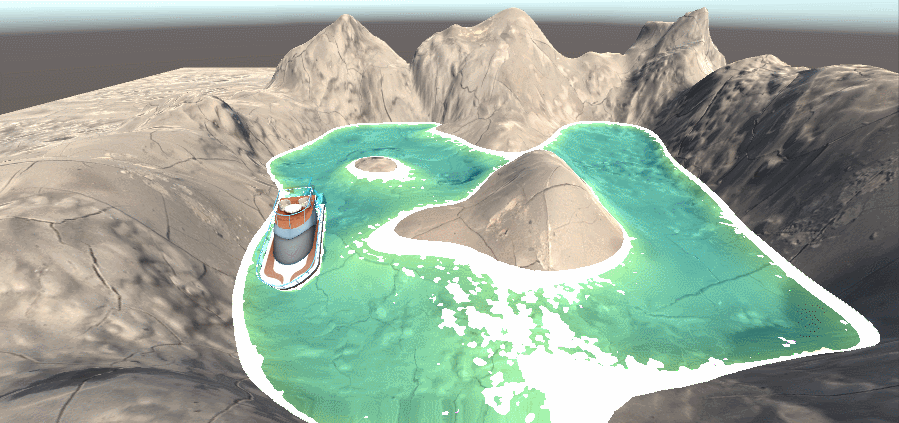

# 卡通水体的制作

话不多说，先上效果图



该水体编写时，用到了GrabPass抓取屏幕，深度纹理，法线变换，菲涅尔反射，噪声纹理，以及顶点动画相关的知识

本篇中，仅解释编写原理，源码会在最后方放出，后续会不定期更新文档。

## 水体部分


## 浪花部分

## 通过顶点动画让水体动起来

## 全部代码

```c
//卡通水体
//深度纹理与菲涅尔反射的综合应用
Shader "Unlit/ToonWaterShader"
{
	Properties
	{
		// 水体颜色
		_WaterColor ("WaterColor", COLOR) = (1,1,1,1)
		// 浪花深度
		_DepthScale("Depth Scale",Float) = 0.1
		// 波浪噪声纹理
		_WaveNoise("WaveTexture",2D) = "white" {}
		// 菲涅尔反射颜色
		_ReflectColor ("Reflect Color",Color) = (0, 0, 1, 1)
		// 浅水区颜色
		_DepthColor ("Depth Color",Color) = (0, 0, 1, 1)
		// 菲涅尔反射幅度
		_FresnelScale ("Fresnel Scale", Range(0, 1)) = 1
		// 水体法线
		_BumpMap ("Normal Map", 2D) = "bump" {}
		// 法线影响度
		_BumpScale("Bump Scale" ,Range(0,1)) = 1
	}
	SubShader
	{
		Tags { "RenderType"="Opaque" "Queue"="Transparent" }
		LOD 100
		//抓取屏幕图像，存在名为_RefractionTex的变量中
		GrabPass { "_RefractionTex" }
		Pass
		{
			CGPROGRAM
			#pragma vertex vert
			#pragma fragment frag
			
			#include "UnityCG.cginc"
			// 声明抓取的变量
			sampler2D _RefractionTex;
			float4 _RefractionTex_TexelSize;
			// 声明深度图
			sampler2D _CameraDepthTexture;
			//声明Properties各项变量
			sampler2D _WaveNoise;
			float4 _WaveNoise_ST;
			float _DepthScale;
			fixed4 _WaterColor;
			fixed4 _ReflectColor;
			fixed _FresnelScale;
			fixed4 _DepthColor;

			sampler2D _BumpMap;
			float4 _BumpMap_ST;
			float _BumpScale;

			//定义顶点着色器结构体
			struct appdata
			{
				float4 vertex : POSITION;
				float2 uv : TEXCOORD0;
				float4 tangent : TANGENT;
				float3 normal : NORMAL;
			};
			//定义片元着色器结构体
			struct v2f
			{
				float2 uv : TEXCOORD0;
				float4 vertex : SV_POSITION;
				float4 scrPos : TEXCOORD1;
				float3 worldPos : TEXCOORD2;
  				fixed3 worldNormal : TEXCOORD3;
  				fixed3 worldViewDir : TEXCOORD4;
				//TBN矩阵
				half3 wNormal : TEXCOORD5;
                half3 wTangent : TEXCOORD6;
                half3 wBitangent : TEXCOORD7;
			};
			
			v2f vert (appdata v)
			{
				v2f o;
				//定义偏移参数，根据时间变换顶点，使x轴顶点按照sin曲线运动
				float4 offset;
				offset.xyzw = float4(0.0,0.0, 0.0, 0.0);
				//offset.x = sin(_Frequency * _Time.y + v.vertex.x * _InvWaveLength + v.vertex.y * _InvWaveLength + v.vertex.z * _InvWaveLength) * _Magnitude;
				offset.x = cos(_Time.y + v.vertex.z)*0.3;
				o.vertex = UnityObjectToClipPos(v.vertex+offset);
				//
				o.uv = v.uv;
				o.scrPos = ComputeGrabScreenPos(o.vertex);
				o.worldNormal = UnityObjectToWorldNormal(v.normal);
				o.worldPos = mul(unity_ObjectToWorld, v.vertex).xyz;
				o.worldViewDir = UnityWorldSpaceViewDir(o.worldPos);

				//计算TBN矩阵所用的三组变量。
				o.wTangent = UnityObjectToWorldDir(v.tangent.xyz);
                o.wNormal = UnityObjectToWorldNormal(v.normal);
                // compute bitangent from cross product of normal and tangent
                // 通过计算法线与切线的叉积，得到二次切线bitangent,叉积*切线方向
                // half tangentSign = v.tangent.w * unity_WorldTransformParams.w;
                // output the tangent space matrix
                half tangentSign = v.tangent.w;
                o.wBitangent = cross(o.wNormal, o.wTangent) * tangentSign;
				return o;
			}
			
			fixed4 frag (v2f i) : SV_Target
			{
				fixed3 worldNormal = normalize(i.worldNormal);
				fixed3 worldViewDir = normalize(i.worldViewDir);

				half3 tnormal = UnpackNormal(tex2D(_BumpMap, i.uv));
				float3x3 TBNMatrix = float3x3(i.wTangent,i.wBitangent,i.wNormal);
				worldNormal = mul(tnormal,TBNMatrix);
				//half3 worldViewDir = UnityWorldSpaceViewDir(i.worldPos);
				half3 worldRefra = refract(worldViewDir,worldNormal,_BumpScale);
				float2 offset = worldRefra.xy;
				//i.scrPos.xy = offset * i.scrPos.z + i.scrPos.xy;

				// sample the texture
				//fixed4 refrCol = tex2D(_RefractionTex,i.uv);
				fixed4 refrCol = tex2D(_CameraDepthTexture, i.scrPos.xy/i.scrPos.w);
				i.scrPos.xy = offset * i.scrPos.z + i.scrPos.xy;
				fixed4 refrColScreen = tex2D(_RefractionTex,i.scrPos.xy/i.scrPos.w);
				
				fixed4 WaveNoise = tex2D(_WaveNoise,i.uv);
				
				float depth = SAMPLE_DEPTH_TEXTURE(_CameraDepthTexture, i.uv);
				float linearDepth = LinearEyeDepth(refrCol.r);
				float diff = linearDepth - i.scrPos.w;
				fixed4 intersect = fixed4(1,1,1,1)-fixed4(diff*_DepthScale,diff*_DepthScale,diff*_DepthScale,1);
				fixed4 border = floor(saturate(intersect+WaveNoise)*2);

				fixed4 depthColor = (1-saturate(diff)) * _DepthColor;

				fixed4 reflection = _ReflectColor;
				fixed fresnel = _FresnelScale + (1 - _FresnelScale) * pow(1 - dot(worldViewDir, worldNormal), 5)*_BumpScale;
				fixed4 diffuse = _WaterColor*refrColScreen+depthColor+border;
				
				fixed4 colorfinal = lerp(diffuse, reflection, saturate(fresnel));
				return colorfinal;
			}
			ENDCG
		}
	}
}

```
